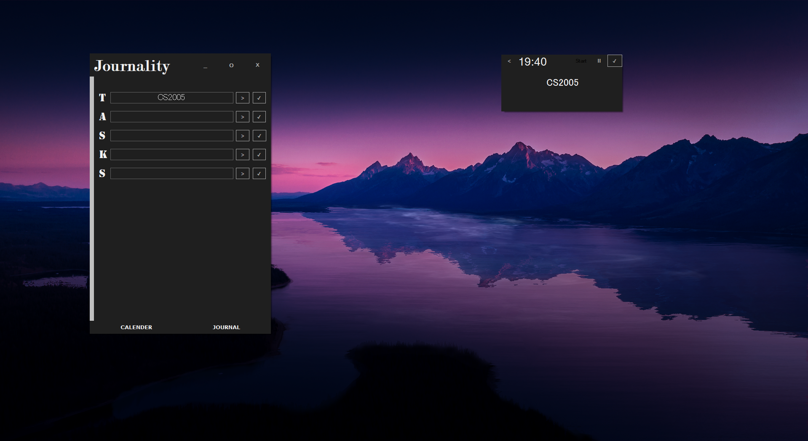

# WindowsFormsApp1
Journality productivity app (in progress)

This app was designed to help with productivity especially during a year of homestudy/work. 
The goal is to (when doing a task) have a popup of the task and the time assigned to it as a constant reminder.
---Said task can be paused, for a maximum duration of 15min.
